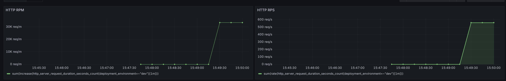
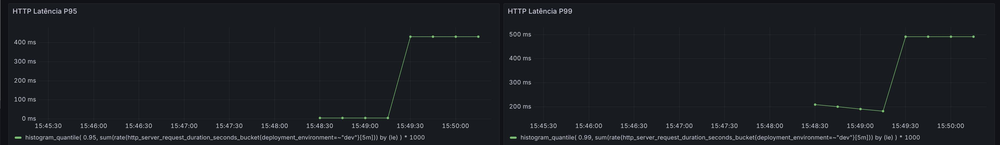
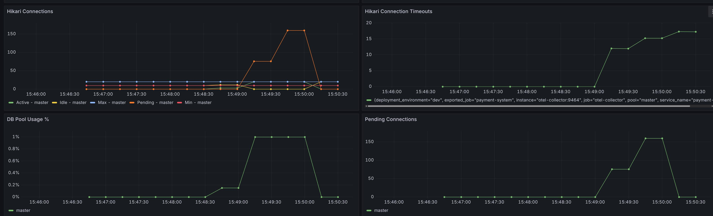
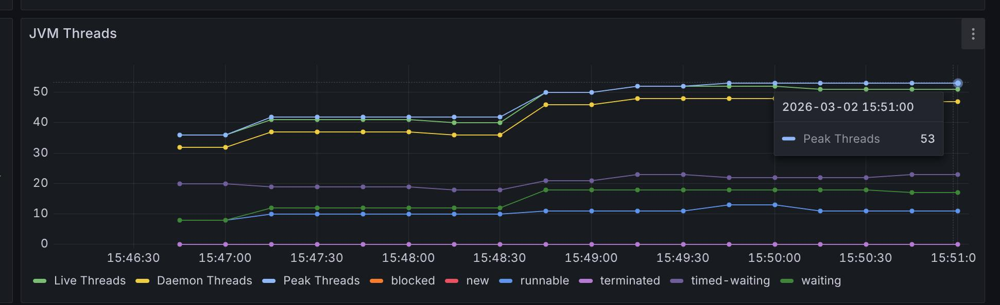
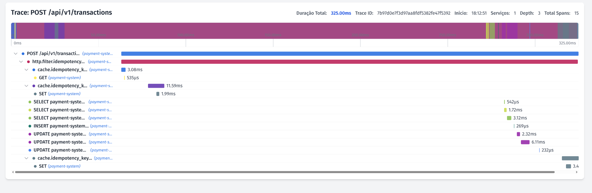

# Spike de Performance — Transferências PIX

## Objetivo
Identificar gargalos de performance no fluxo de transferências e validar a capacidade do sistema sob carga concorrente.

O objetivo deste spike foi:
- Medir comportamento sob alta concorrência
- Identificar gargalos (DB, pool, locks)
- Validar consistência dos saldos
- Capturar métricas reais (Hikari, HTTP, Postgres)
- Identificar limites do ambiente local

## Ambiente de Teste
### Infraestrutura
Ambiente local usando Docker:
- Application: Spring Boot
- Database: PostgreSQL 17
- Pool: HikariCP
- Ryzen 5 5600G, 32GB RAM, GTX 1660 Super, SSD NVMe

Configuração atual:
```yaml
hikari:
  maximum-pool-size: 20
  minimum-idle: 10
  connection-timeout: 250ms
```
Nenhuma otimização foi aplicada ainda.
Configuração equivalente ao ambiente de produção planejado.

## Cenário de Teste
Teste executado com k6.
### Spike Test
```text
1 → 20 VUs (10s)
20 → 500 VUs (10s)
500 VUs (1 min)
500 → 20 (10s)
```
### Fluxo testado por iteração
Cada VU executa:
1. Deposit
2. Transfer

Eventualmente (1%):
3. GET balance (validação)

Fluxo:
```text
Deposit → Transfer → (GET opcional)
```

## Melhorias no Teste
### Problema inicial
O teste original executava:
```text
Create account
Create pix key
Deposit
GET balance
Transfer
GET balance
GET balance
```
Problemas:
- Muito INSERT
- Muito SELECT
- Não representava produção
- Saturava pool artificialmente
- Dificultava identificar gargalos reais

### Mudança realizada
O teste foi alterado para:
```text
Deposit
Transfer
```
Com validação amostral:
```text
GET balance (~1% das requisições)
```

Benefícios:
- Redução significativa de round-trips ao DB
- Medição mais fiel do throughput
- Menos ruído nos resultados
- Mais próximo do tráfego real

## Mudança Arquitetural
### Remoção de SELECT FOR UPDATE
Antes:
```sql
SELECT * FROM accounts
WHERE id = ?
FOR UPDATE
```
Depois:
Uso exclusivo de Optimistic Locking:
```sql
UPDATE accounts
SET balance = ?, version = version + 1
WHERE id = ?
AND version = ?
```

Motivação:
- Reduzir lock contention
- Melhorar paralelismo
- Evitar espera por locks

## Resultados
### Antes (com FOR UPDATE)
Comportamento observado:
- Lock contention elevado
- Latência crescente
- Pool saturando rapidamente
- Throughput baixo

FOR UPDATE representava ~36% do tempo total das queries.

### Depois (sem FOR UPDATE)
Observações:
- Lock contention reduzido
- Queries rápidas (< 1ms)
- Pool ainda é gargalo sob spike
- Sistema estável até ~100–150 VUs

Métricas observadas:
### Hikari
- Active ≈ Max (20)
- Pending > 200 no pico
- Timeouts presentes

### PostgreSQL
pg_stat_statements mostrou:
Principais queries:
- UPDATE accounts (~70% do tempo)
- SELECT pix_keys
- INSERT transactions

Mean execution time: < 1ms

### Conclusão:
DB não é gargalo por query lenta.

## Execução do Spike Test
Comando executado:
```shell
./run_test.sh spike_test.js dev
```

Configuração do teste:
```text
1 → 20 VUs (10s)
20 → 500 VUs (10s)
500 VUs (1 min)
500 → 20 (10s)
```

Capacidade máxima testada:
```text
500 VUs
~580 requests/s
27k iterações
```

Resultados principais:
```text
http_req_duration p95 = 475ms
transfer_duration p95 = 481ms
RPS ≈ 580 req/s
```

Erro observado:
```text
http_req_failed = 14.19%
```

Erro principal identificado:
```text
CannotGetJdbcConnectionException
Failed to obtain JDBC Connection
```

Causa:
```text
Connection pool saturado
maximum-pool-size = 20
connection-timeout = 250ms
```

## Métricas Observadas
### HTTP Throughput
- ~580 requests/s no pico
- ~34k requests/min


Observação:
Sistema manteve throughput estável durante o pico.

### Latência HTTP

- P50 ~150ms
- P95 ~475ms
- P99 ~580ms

### HikariCP Pool

- Active connections atingindo máximo (20)
- Pending connections > 200 no pico
- Timeouts de conexão presentes

Conclusão:
Pool é o gargalo principal.

### JVM Threads

Observações:
- ~50 threads ativas
- Sem crescimento descontrolado
- Sem sinais de deadlock

Conclusão:
Threads não são gargalo atual.

## Próximas Melhorias Planejadas
Ainda não aplicadas:
### Pool
Avaliar:
```text
maximum-pool-size
connection-timeout
```

### Threads
Avaliar:
```text
server.tomcat.threads.max
```

## Evidência por trace (Tempo/Jaeger)

- Trace POST /api/v1/transactions com ~325ms total.
- Spans de banco (SELECT/INSERT/UPDATE) ficaram em sub-ms a poucos ms, indicando que não há query lenta.
- A diferença entre duração total e tempo somado dos spans sugere tempo predominante em espera de recurso.
- Em traces mais lentos (>400ms), ocorreu CannotGetJdbcConnectionException / timeout de Hikari, confirmando contenção no pool de conexões como causa principal da latência.

## Por que isso aconteceu?
- Pool = 20 conexões
- Carga = centenas de requests concorrentes
- Cada request precisa de DB e segura conexão por algum tempo (mesmo que pouco)
- Quando chega perto do limite, forma fila -> latência sobe -> p95 vai pra ~500ms
- Como seu acquire timeout é 250ms, parte dessa fila vira erro, não só latência

